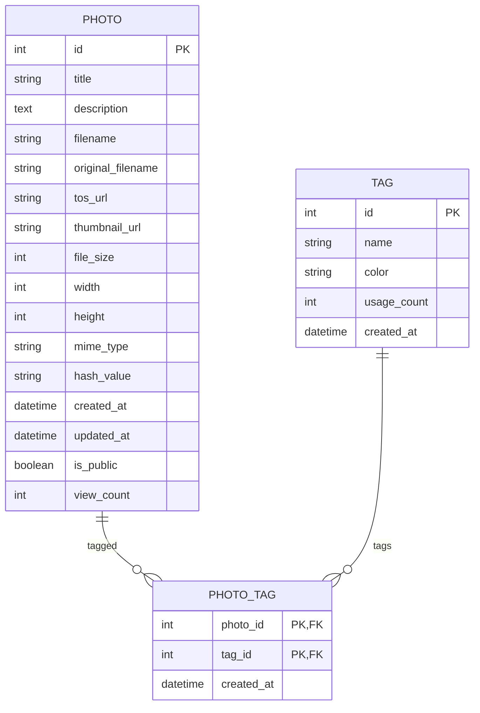

## 来自你的消息
我只需要两个表 图片元数据和标签。上传图片到火山引擎的tos，前端添加标签 并写入数据库。
<environment_details>
# Current Time
2025/11/20 上午11:05:21 (Asia/Shanghai, UTC+8:00)
</environment_details>


## 来自 CodeMaker 的消息
我将为您设计一个简化的图片管理系统，只包含图片元数据和标签两个表，集成火山引擎TOS存储。

## 简化ER图设计



## 核心代码实现

### 1. 项目配置 (config.py)

```python
import os
from datetime import timedelta

class Config:
    SECRET_KEY = os.environ.get('SECRET_KEY') or 'photo-gallery-secret-key'
    SQLALCHEMY_DATABASE_URI = os.environ.get('DATABASE_URL') or 'sqlite:///gallery.db'
    SQLALCHEMY_TRACK_MODIFICATIONS = False
    
    # 火山引擎TOS配置
    TOS_REGION = os.environ.get('TOS_REGION', 'cn-beijing')
    TOS_ACCESS_KEY = os.environ.get('TOS_ACCESS_KEY')
    TOS_SECRET_KEY = os.environ.get('TOS_SECRET_KEY')
    TOS_BUCKET_NAME = os.environ.get('TOS_BUCKET_NAME', 'photo-gallery')
    TOS_ENDPOINT = f'https://tos-s3-{TOS_REGION}.volc.com'
    TOS_CDN_DOMAIN = os.environ.get('TOS_CDN_DOMAIN', '')  # 可选CDN域名
    
    # 上传限制
    MAX_CONTENT_LENGTH = 16 * 1024 * 1024  # 16MB
    ALLOWED_EXTENSIONS = {'png', 'jpg', 'jpeg', 'gif', 'bmp', 'webp'}
    
    # 缩略图设置
    THUMBNAIL_SIZE = (400, 400)
    
    # 分页设置
    PHOTOS_PER_PAGE = 20

class DevelopmentConfig(Config):
    DEBUG = True

class ProductionConfig(Config):
    DEBUG = False

config = {
    'development': DevelopmentConfig,
    'production': ProductionConfig,
    'default': DevelopmentConfig
}
```

### 2. 数据模型 (app/models.py)

```python
from datetime import datetime
from app import db

class Photo(db.Model):
    """图片模型"""
    __tablename__ = 'photo'
    
    id = db.Column(db.Integer, primary_key=True)
    title = db.Column(db.String(200), nullable=False, index=True)
    description = db.Column(db.Text)
    filename = db.Column(db.String(255), nullable=False, unique=True)
    original_filename = db.Column(db.String(255), nullable=False)
    
    # TOS存储相关
    tos_url = db.Column(db.String(500), nullable=False)  # 原图TOS URL
    thumbnail_url = db.Column(db.String(500))  # 缩略图TOS URL
    
    # 文件信息
    file_size = db.Column(db.Integer)
    width = db.Column(db.Integer)
    height = db.Column(db.Integer)
    mime_type = db.Column(db.String(50))
    hash_value = db.Column(db.String(64), unique=True, index=True)  # 防重复上传
    
    # 时间戳
    created_at = db.Column(db.DateTime, default=datetime.utcnow, index=True)
    updated_at = db.Column(db.DateTime, default=datetime.utcnow, onupdate=datetime.utcnow)
    
    # 状态
    is_public = db.Column(db.Boolean, default=True, index=True)
    view_count = db.Column(db.Integer, default=0)
    
    # 关系
    tags = db.relationship('Tag', secondary='photo_tag', back_populates='photos')
    
    def __repr__(self):
        return f'<Photo {self.title}>'
    
    def to_dict(self):
        """转换为字典格式"""
        return {
            'id': self.id,
            'title': self.title,
            'description': self.description,
            'filename': self.filename,
            'original_filename': self.original_filename,
            'tos_url': self.tos_url,
            'thumbnail_url': self.thumbnail_url,
            'file_size': self.file_size,
            'width': self.width,
            'height': self.height,
            'mime_type': self.mime_type,
            'created_at': self.created_at.isoformat() if self.created_at else None,
            'view_count': self.view_count,
            'tags': [{'id': tag.id, 'name': tag.name, 'color': tag.color} for tag in self.tags]
        }

class Tag(db.Model):
    """标签模型"""
    __tablename__ = 'tag'
    
    id = db.Column(db.Integer, primary_key=True)
    name = db.Column(db.String(50), nullable=False, unique=True, index=True)
    color = db.Column(db.String(7), default='#007bff')  # 十六进制颜色
    usage_count = db.Column(db.Integer, default=0, index=True)
    created_at = db.Column(db.DateTime, default=datetime.utcnow)
    
    # 关系
    photos = db.relationship('Photo', secondary='photo_tag', back_populates='tags')
    
    def __repr__(self):
        return f'<Tag {self.name}>'
    
    def to_dict(self):
        """转换为字典格式"""
        return {
            'id': self.id,
            'name': self.name,
            'color': self.color,
            'usage_count': self.usage_count
        }

# 关联表
photo_tag = db.Table('photo_tag',
    db.Column('photo_id', db.Integer, db.ForeignKey('photo.id'), primary_key=True),
    db.Column('tag_id', db.Integer, db.ForeignKey('tag.id'), primary_key=True),
    db.Column('created_at', db.DateTime, default=datetime.utcnow)
)
```

### 3. TOS工具类 (app/tos_client.py)

```python
import os
import hashlib
import uuid
from io import BytesIO
from PIL import Image, ImageOps
import tos
from flask import current_app

class TOSClient:
    """火山引擎TOS客户端"""
    
    def __init__(self):
        self.client = None
        self._init_client()
    
    def _init_client(self):
        """初始化TOS客户端"""
        try:
            self.client = tos.TosClientV2(
                region=current_app.config['TOS_REGION'],
                access_key=current_app.config['TOS_ACCESS_KEY'],
                secret_key=current_app.config['TOS_SECRET_KEY'],
                endpoint=current_app.config['TOS_ENDPOINT']
            )
        except Exception as e:
            print(f"TOS客户端初始化失败: {e}")
    
    def generate_filename(self, original_filename: str) -> str:
        """生成唯一文件名"""
        ext = original_filename.rsplit('.', 1)[1].lower() if '.' in original_filename else 'jpg'
        return f"{uuid.uuid4().hex}.{ext}"
    
    def calculate_file_hash(self, file_content: bytes) -> str:
        """计算文件MD5哈希值"""
        return hashlib.md5(file_content).hexdigest()
    
    def get_image_info(self, file_content: bytes) -> dict:
        """获取图片信息"""
        try:
            with Image.open(BytesIO(file_content)) as img:
                img = ImageOps.exif_transpose(img)
                return {
                    'width': img.width,
                    'height': img.height,
                    'format': img.format,
                    'mode': img.mode
                }
        except Exception as e:
            print(f"获取图片信息失败: {e}")
            return {'width': 0, 'height': 0, 'format': 'Unknown', 'mode': 'Unknown'}
    
    def create_thumbnail(self, file_content: bytes, size: tuple = (400, 400)) -> bytes:
        """创建缩略图"""
        try:
            with Image.open(BytesIO(file_content)) as img:
                # 自动旋转图片
                img = ImageOps.exif_transpose(img)
                
                # 如果是RGBA，转换为RGB
                if img.mode in ('RGBA', 'LA', 'P'):
                    background = Image.new('RGB', img.size, (255, 255, 255))
                    if img.mode == 'P':
                        img = img.convert('RGBA')
                    background.paste(img, mask=img.split()[-1] if img.mode == 'RGBA' else None)
                    img = background
                
                # 创建缩略图
                img.thumbnail(size, Image.Resampling.LANCZOS)
                
                # 保存为字节流
                thumbnail_buffer = BytesIO()
                img.save(thumbnail_buffer, format='JPEG', optimize=True, quality=85)
                return thumbnail_buffer.getvalue()
                
        except Exception as e:
            print(f"创建缩略图失败: {e}")
            return None
    
    def upload_file(self, file_content: bytes, filename: str, content_type: str) -> str:
        """上传文件到TOS"""
        try:
            bucket_name = current_app.config['TOS_BUCKET_NAME']
            key = f"photos/{filename}"
            
            # 上传文件
            result = self.client.put_object(
                bucket=bucket_name,
                key=key,
                content=file_content,
                content_type=content_type
            )
            
            # 返回文件URL
            if current_app.config.get('TOS_CDN_DOMAIN'):
                return f"https://{current_app.config['TOS_CDN_DOMAIN']}/{key}"
            else:
                return f"https://{bucket_name}.{current_app.config['TOS_REGION']}.volc.com/{key}"
                
        except Exception as e:
            print(f"上传文件失败: {e}")
            raise e
    
    def upload_thumbnail(self, thumbnail_content: bytes, filename: str) -> str:
        """上传缩略图到TOS"""
        try:
            bucket_name = current_app.config['TOS_BUCKET_NAME']
            key = f"thumbnails/{filename}"
            
            result = self.client.put_object(
                bucket=bucket_name,
                key=key,
                content=thumbnail_content,
                content_type='image/jpeg'
            )
            
            if current_app.config.get('TOS_CDN_DOMAIN'):
                return f"https://{current_app.config['TOS_CDN_DOMAIN']}/{key}"
            else:
                return f"https://{bucket_name}.{current_app.config['TOS_REGION']}.volc.com/{key}"
                
        except Exception as e:
            print(f"上传缩略图失败: {e}")
            raise e
    
    def delete_file(self, filename: str):
        """删除文件"""
        try:
            bucket_name = current_app.config['TOS_BUCKET_NAME']
            
            # 删除原图和缩略图
            self.client.delete_object(bucket=bucket_name, key=f"photos/{filename}")
            self.client.delete_object(bucket=bucket_name, key=f"thumbnails/{filename}")
            
        except Exception as e:
            print(f"删除文件失败: {e}")

# 全局TOS客户端实例
tos_client = TOSClient()
```

### 4. API路由 (app/routes.py)

```python
from flask import Blueprint, request, jsonify, render_template
from sqlalchemy import or_, func
from app import db
from app.models import Photo, Tag
from app.tos_client import tos_client
from werkzeug.utils import secure_filename

bp = Blueprint('api', __name__)

@bp.route('/')
def index():
    """首页"""
    return render_template('index.html')

@bp.route('/api/photos', methods=['GET'])
def get_photos():
    """获取图片列表"""
    page = request.args.get('page', 1, type=int)
    per_page = request.args.get('per_page', 20, type=int)
    tag_id = request.args.get('tag_id', type=int)
    search = request.args.get('search', '').strip()
    
    # 构建查询
    query = Photo.query.filter_by(is_public=True)
    
    # 按标签筛选
    if tag_id:
        query = query.join(Photo.tags).filter(Tag.id == tag_id)
    
    # 搜索
    if search:
        query = query.filter(
            or_(
                Photo.title.contains(search),
                Photo.description.contains(search)
            )
        )
    
    # 分页
    photos = query.order_by(Photo.created_at.desc()).paginate(
        page=page, per_page=per_page, error_out=False
    )
    
    return jsonify({
        'photos': [photo.to_dict() for photo in photos.items],
        'pagination': {
            'page': photos.page,
            'pages': photos.pages,
            'per_page': photos.per_page,
            'total': photos.total,
            'has_prev': photos.has_prev,
            'has_next': photos.has_next
        }
    })

@bp.route('/api/photos/<int:photo_id>', methods=['GET'])
def get_photo(photo_id):
    """获取单张图片详情"""
    photo = Photo.query.get_or_404(photo_id)
    
    # 增加浏览次数
    photo.view_count += 1
    db.session.commit()
    
    return jsonify(photo.to_dict())

@bp.route('/api/upload', methods=['POST'])
def upload_photos():
    """上传图片"""
    if 'files' not in request.files:
        return jsonify({'error': '没有选择文件'}), 400
    
    files = request.files.getlist('files')
    if not files or all(f.filename == '' for f in files):
        return jsonify({'error': '没有选择文件'}), 400
    
    uploaded_photos = []
    errors = []
    
    for file in files:```python
        if file and file.filename:
            try:
                # 读取文件内容
                file_content = file.read()
                file_size = len(file_content)
                
                # 检查文件大小
                if file_size > 16 * 1024 * 1024:  # 16MB
                    errors.append(f'{file.filename}: 文件大小超过限制')
                    continue
                
                # 计算文件哈希值，检查重复
                file_hash = tos_client.calculate_file_hash(file_content)
                existing_photo = Photo.query.filter_by(hash_value=file_hash).first()
                if existing_photo:
                    errors.append(f'{file.filename}: 文件已存在')
                    continue
                
                # 生成文件名并上传到TOS
                filename = tos_client.generate_filename(file.filename)
                tos_url = tos_client.upload_file(file_content, filename, file.content_type)
                
                # 创建并上传缩略图
                thumbnail_content = tos_client.create_thumbnail(file_content)
                thumbnail_url = None
                if thumbnail_content:
                    thumbnail_url = tos_client.upload_thumbnail(thumbnail_content, filename)
                
                # 获取图片信息
                img_info = tos_client.get_image_info(file_content)
                
                # 保存到数据库
                photo = Photo(
                    title=secure_filename(file.filename).rsplit('.', 1)[0],
                    filename=filename,
                    original_filename=file.filename,
                    tos_url=tos_url,
                    thumbnail_url=thumbnail_url,
                    file_size=file_size,
                    width=img_info.get('width', 0),
                    height=img_info.get('height', 0),
                    mime_type=file.content_type,
                    hash_value=file_hash
                )
                
                db.session.add(photo)
                db.session.commit()
                
                uploaded_photos.append(photo.to_dict())
                
            except Exception as e:
                errors.append(f'{file.filename}: 上传失败 - {str(e)}')
    
    return jsonify({
        'success': len(uploaded_photos) > 0,
        'uploaded_photos': uploaded_photos,
        'errors': errors,
        'count': len(uploaded_photos)
    })

@bp.route('/api/photos/<int:photo_id>/tags', methods=['POST'])
def add_photo_tags(photo_id):
    """为图片添加标签"""
    photo = Photo.query.get_or_404(photo_id)
    data = request.get_json()
    tag_names = data.get('tags', [])
    
    if not isinstance(tag_names, list):
        return jsonify({'error': '标签必须是数组格式'}), 400
    
    added_tags = []
    for tag_name in tag_names:
        tag_name = tag_name.strip()
        if not tag_name:
            continue
            
        # 查找或创建标签
        tag = Tag.query.filter_by(name=tag_name).first()
        if not tag:
            tag = Tag(name=tag_name)
            db.session.add(tag)
        
        # 添加标签到图片
        if tag not in photo.tags:
            photo.tags.append(tag)
            tag.usage_count += 1
            added_tags.append(tag.to_dict())
    
    db.session.commit()
    return jsonify({'added_tags': added_tags, 'photo': photo.to_dict()})

@bp.route('/api/tags', methods=['GET'])
def get_tags():
    """获取标签列表"""
    tags = Tag.query.order_by(Tag.usage_count.desc()).limit(50).all()
    return jsonify([tag.to_dict() for tag in tags])

@bp.route('/api/photos/<int:photo_id>', methods=['DELETE'])
def delete_photo(photo_id):
    """删除图片"""
    photo = Photo.query.get_or_404(photo_id)
    
    try:
        # 删除TOS文件
        tos_client.delete_file(photo.filename)
        
        # 删除数据库记录
        db.session.delete(photo)
        db.session.commit()
        
        return jsonify({'message': '图片删除成功'})
    except Exception as e:
        db.session.rollback()
        return jsonify({'error': f'删除失败: {str(e)}'}), 500
```

### 5. 前端HTML模板 (app/templates/index.html)

```html
<!DOCTYPE html>
<html lang="zh-CN">
<head>
    <meta charset="UTF-8">
    <meta name="viewport" content="width=device-width, initial-scale=1.0">
    <title>图片画廊</title>
    <link href="https://cdn.jsdelivr.net/npm/bootstrap@5.1.3/dist/css/bootstrap.min.css" rel="stylesheet">
    <style>
        .photo-card { cursor: pointer; transition: transform 0.2s; }
        .photo-card:hover { transform: translateY(-5px); }
        .tag-badge { margin: 2px; cursor: pointer; }
        .upload-area { border: 2px dashed #ccc; padding: 40px; text-align: center; }
        .upload-area.dragover { border-color: #007bff; background-color: #f8f9fa; }
    </style>
</head>
<body>
    <div class="container mt-4">
        <h1 class="text-center mb-4">图片画廊</h1>
        
        <!-- 上传区域 -->
        <div class="upload-area mb-4" id="uploadArea">
            <input type="file" id="fileInput" multiple accept="image/*" style="display: none;">
            <p>拖拽图片到此处或<button class="btn btn-link p-0" onclick="document.getElementById('fileInput').click()">点击选择</button></p>
        </div>
        
        <!-- 标签筛选 -->
        <div class="mb-3">
            <span class="me-2">标签筛选:</span>
            <div id="tagFilters" class="d-inline"></div>
        </div>
        
        <!-- 图片网格 -->
        <div id="photoGrid" class="row g-3"></div>
        
        <!-- 分页 -->
        <nav class="mt-4">
            <ul id="pagination" class="pagination justify-content-center"></ul>
        </nav>
    </div>

    <!-- 图片详情模态框 -->
    <div class="modal fade" id="photoModal" tabindex="-1">
        <div class="modal-dialog modal-lg">
            <div class="modal-content">
                <div class="modal-header">
                    <h5 class="modal-title" id="photoTitle"></h5>
                    <button type="button" class="btn-close" data-bs-dismiss="modal"></button>
                </div>
                <div class="modal-body text-center">
                    
                    <p id="photoDescription"></p>
                    <div>
                        <strong>标签:</strong>
                        <div id="photoTags"></div>
                        <div class="mt-2">
                            <input type="text" id="newTags" class="form-control" placeholder="输入新标签，用逗号分隔">
                            <button class="btn btn-primary btn-sm mt-2" onclick="addTags()">添加标签</button>
                        </div>
                    </div>
                </div>
            </div>
        </div>
    </div>

    <script src="https://cdn.jsdelivr.net/npm/bootstrap@5.1.3/dist/js/bootstrap.bundle.min.js"></script>
    <script>
        let currentPage = 1;
        let currentTagId = null;
        let currentPhotoId = null;

        // 页面加载完成后初始化
        document.addEventListener('DOMContentLoaded', function() {
            loadPhotos();
            loadTags();
            setupUpload();
        });

        // 加载图片列表
        function loadPhotos(page = 1) {
            let url = `/api/photos?page=${page}`;
            if (currentTagId) url += `&tag_id=${currentTagId}`;
            
            fetch(url)
                .then(response => response.json())
                .then(data => {
                    displayPhotos(data.photos);
                    updatePagination(data.pagination);
                    currentPage = page;
                });
        }

        // 显示图片
        function displayPhotos(photos) {
            const grid = document.getElementById('photoGrid');
            grid.innerHTML = photos.map(photo => `
                <div class="col-lg-3 col-md-4 col-sm-6">
                    <div class="card photo-card h-100" onclick="showPhoto(${photo.id})">
                        
                        <div class="card-body p-2">
                            <h6 class="card-title mb-1">${photo.title}</h6>
                            <div class="mb-1">
                                ${photo.tags.map(tag => 
                                    `<span class="badge bg-primary tag-badge" style="background-color: ${tag.color}!important">${tag.name}</span>`
                                ).join('')}
                            </div>
                            <small class="text-muted">${new Date(photo.created_at).toLocaleDateString()}</small>
                        </div>
                    </div>
                </div>
            `).join('');
        }

        // 显示图片详情
        function showPhoto(photoId) {
            fetch(`/api/photos/${photoId}`)
                .then(response => response.json())
                .then(photo => {
                    currentPhotoId = photoId;
                    document.getElementById('photoTitle').textContent = photo.title;
                    document.getElementById('photoImage').src = photo.tos_url;
                    document.getElementById('photoDescription').textContent = photo.description || '暂无描述';
                    
                    const tagsDiv = document.getElementById('photoTags');
                    tagsDiv.innerHTML = photo.tags.map(tag => 
                        `<span class="badge bg-primary me-1" style="background-color: ${tag.color}!important">${tag.name}</span>`
                    ).join('');
                    
                    new bootstrap.Modal(document.getElementById('photoModal')).show();
                });
        }

        // 添加标签
        function addTags() {
            const newTags = document.getElementById('newTags').value.trim();
            if (!newTags || !currentPhotoId) return;
            
            const tags = newTags.split(',').map(tag => tag.trim()).filter(tag => tag);
            
            fetch(`/api/photos/${currentPhotoId}/tags`, {
                method: 'POST',
                headers: {'Content-Type': 'application/json'},
                body: JSON.stringify({tags: tags})
            })
            .then(response => response.json())
            .then(data => {
                document.getElementById('newTags').value = '';
                showPhoto(currentPhotoId); // 刷新显示
                loadTags(); // 刷新标签列表
            });
        }

        // 设置文件上传
        function setupUpload() {
            const uploadArea = document.getElementById('uploadArea');
            const fileInput = document.getElementById('fileInput');
            
            // 拖拽上传
            uploadArea.addEventListener('dragover', e => {
                e.preventDefault();
                uploadArea.classList.add('dragover');
            });
            
            uploadArea.addEventListener('dragleave', () => {
                uploadArea.classList.remove('dragover');
            });
            
            uploadArea.addEventListener('drop', e => {
                e.preventDefault();
                uploadArea.classList.remove('dragover');
                uploadFiles(e.dataTransfer.files);
            });
            
            // 点击上传
            fileInput.addEventListener('change', e => {
                uploadFiles(e.target.files);
            });
        }

        // 上传文件
        function uploadFiles(files) {
            if (files.length === 0) return;
            
            const formData = new FormData();
            Array.from(files).forEach(file => {
                formData.append('files', file);
            });
            
            fetch('/api/upload', {
                method: 'POST',
                body: formData
            })
            .then(response => response.json())
            .then(data => {
                if (data.success) {
                    alert(`成功上传 ${data.count} 张图片！`);
                    loadPhotos(1);
                }
                if (data.errors.length > 0) {
                    alert('部分文件上传失败:\n' + data.errors.join('\n'));
                }
            });
        }

        // 加载标签
        function loadTags() {
            fetch('/api/tags')
                .then(response => response.json())
                .then(tags => {
                    const filtersDiv = document.getElementById('tagFilters');
                    filtersDiv.innerHTML = `
                        <span class="badge bg-secondary tag-badge ${!currentTagId ? 'bg-dark' : ''}" onclick="filterByTag(null)">全部</span>
                        ${tags.map(tag => 
                            `<span class="badge tag-badge ${currentTagId === tag.id ? 'bg-dark' : ''}" 
                                   style="background-color: ${tag.color}!important" 
                                   onclick="filterByTag(${tag.id})">${tag.name} (${tag.usage_count})</span>`
                        ).join('')}
                    `;
                });
        }

        // 按标签筛选
        function filterByTag(tagId) {
            currentTagId = tagId;
            loadPhotos(1);
            loadTags();
        }

        // 更新分页
        function updatePagination(pagination) {
            const paginationDiv = document.getElementById('pagination');
            if (pagination.pages <= 1) {
                paginationDiv.innerHTML = '';
                return;
            }
            
            let html = '';
            if (pagination.has_prev) {
                html += `<li class="page-item"><a class="page-link" href="#" onclick="loadPhotos(${pagination.page - 1})">上一页</a></li>`;
            }
            
            for (let i = 1; i <= pagination.pages; i++) {
                html += `<li class="page-item ${i === pagination.page ? 'active' : ''}">
                    <a class="page-link" href="#" onclick="loadPhotos(${i})">${i}</a>
                </li>`;
            }
            
            if (pagination.has_next) {
                html += `<li class="page-item"><a class="page-link" href="#" onclick="loadPhotos(${pagination.page + 1})">下一页</a></li>`;
            }
            
            paginationDiv.innerHTML = html;
        }
    </script>
</body>
</html>
```

### 6. 依赖包 (requirements.txt)

```txt
Flask==2.3.3
Flask-SQLAlchemy==3.0.5
Flask-Migrate==4.0.5```txt
Pillow==10.0.1
tos==2.6.1
python-dotenv==1.0.0
```

### 7. 应用初始化 (app/__init__.py)

```python
from flask import Flask
from flask_sqlalchemy import SQLAlchemy
from flask_migrate import Migrate
from config import config

db = SQLAlchemy()
migrate = Migrate()

def create_app(config_name='default'):
    app = Flask(__name__)
    app.config.from_object(config[config_name])
    
    db.init_app(app)
    migrate.init_app(app, db)
    
    from app.routes import bp as main_bp
    app.register_blueprint(main_bp)
    
    return app
```

### 8. 启动文件 (run.py)

```python
import os
from app import create_app, db

app = create_app(os.environ.get('FLASK_ENV', 'development'))

@app.shell_context_processor
def make_shell_context():
    return {'db': db}

if __name__ == '__main__':
    with app.app_context():
        db.create_all()
    app.run(debug=True, host='0.0.0.0', port=5000)
```

### 9. 环境变量配置 (.env)

```bash
# 火山引擎TOS配置
TOS_REGION=cn-beijing
TOS_ACCESS_KEY=your_access_key
TOS_SECRET_KEY=your_secret_key
TOS_BUCKET_NAME=your-bucket-name
TOS_CDN_DOMAIN=your-cdn-domain.com

# Flask配置
SECRET_KEY=your-secret-key-here
FLASK_ENV=development
```

## 运行步骤

1. **安装依赖**: `pip install -r requirements.txt`
2. **配置环境变量**: 创建 `.env` 文件并填入TOS配置
3. **初始化数据库**: `python run.py`
4. **访问应用**: 浏览器打开 `http://localhost:5000`

## 主要功能

- ✅ 拖拽/点击上传多张图片到TOS
- ✅ 自动生成缩略图并上传
- ✅ 前端添加/显示标签
- ✅ 按标签筛选图片
- ✅ 响应式瀑布流展示
- ✅ 防重复上传（基于文件哈希）
- ✅ 浏览统计和分页功能

这个简化版本专注于核心功能，使用火山引擎TOS作为图片存储，前端交互流畅，适合快速部署使用！